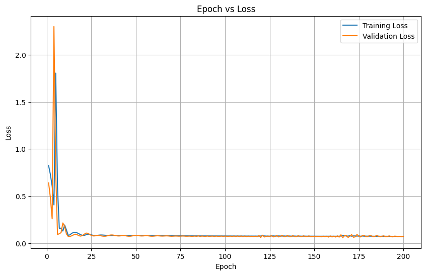
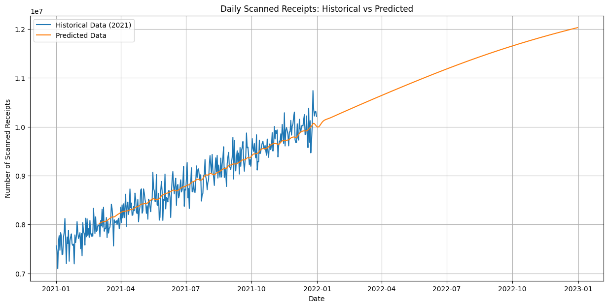

# Receipt Scan Predictor

Welcome to the Receipt Scan Predictor! This project uses a Long Short-Term Memory (LSTM) neural network built from scratch with PyTorch to predict the number of scanned receipts for each month of 2022, based on daily data from 2021.

## Overview

At Fetch Rewards, monitoring the number of scanned receipts is crucial for business insights. This project addresses the challenge of predicting monthly scanned receipts using an LSTM model, showcasing machine learning expertise without relying on high-level libraries like scikit-learn or a simple linear regression.

The model itself is trained based on the past x days to predict the price for the current day, for example given the past 60 days we want to predict the number of receipts today. Each sequence consists of the price of a certain day and the number of days starting from 2021, standardized with log1p and z-score for price and just z-score for day number. 

## Model Details

### Hyperparameters

The model's performance hinges on carefully selected hyperparameters:

- **Sequence Length**: 60
- **Input Size**: 2
- **Hidden Size**: 400
- **Number of Layers**: 3
- **Batch Size**: 256
- **Number of Epochs**: 300
- **Learning Rate**: 0.001
- **Loss Function**: Mean Squared Error (MSE)
- **Optimizer**: Adam

Feel free to tweak these hyperparameters in `train.py` to see how they affect the model's performance.

### Loss Curve

The loss curve below illustrates the model's training and validation loss over epochs:



### Predictions vs. Actuals

Here's how the model's predictions stack up against the actual data:



As you can see, the model captures the linear trend of the existing data quite well and some of the variation given by the non-straight line. In the next year, predictions do curve down a bit, unlike if I fit the standard linear regression, which could match trends in the real world which don't scale linearly forever or just LSTMs not being the best for this data.

## Installation

To run this project locally, follow these steps:

1. **Clone the Repository**

   ```bash
   git clone XXX
   cd YYY
   ```
2. **Install Dependencies**

   Ensure you have Python 3.11.3+ installed. Install the required packages:

   ```bash
   pip install -r requirements.txt
   ```
3. **Prepare the Data**

   Place the `data_daily.csv` file in the project directory.
4. **Train the Model**

   Run the training script to generate the model:

   ```bash
   python train.py
   ```

## Usage

To start the Flask app:

```bash
python app.py
```

Open your browser and navigate to `http://127.0.0.1:5000/` to interact with the app.

### Features

- **User Interaction**: Input a future date to predict receipts up to that date.
- **Visualizations**: View the monthly aggregated receipts in a bar chart, including both actual and predicted data.
- **Data Table**: See a table listing monthly receipts.

## Dockerization

To run the app in a Docker container:

1. **Build the Docker Image**

   ```bash
   docker build -t receipt-predictor .
   ```
2. **Run the Docker Container**

   ```bash
   docker run -p 5000:5000 receipt-predictor
   ```

Access the app at `http://localhost:5000/`.

## Notes

- **Simplicity vs. Complexity**: While an LSTM model is powerful, sometimes simpler models can perform just as well. In fact, a simple least squares linear regression might have done a decent job—proving that sometimes, you don't need a neural network to solve every problem!
- **Extensibility**: The app is designed with flexibility in mind. You can easily extend it by experimenting with different models or adding more features.

Thank you for checking out the Receipt Scan Predictor. We hope it predicts not just receipts but also a chance at an interview!
